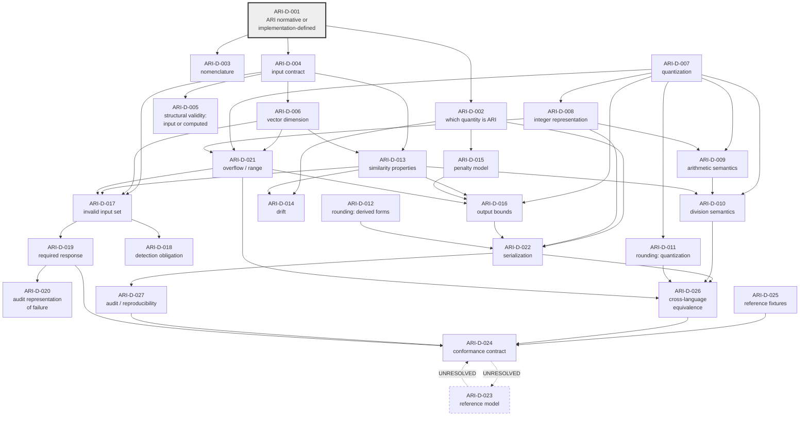

# 05 — DEPENDENCY GRAPH

**Package:** RD-1-ARI-DECISION-READINESS · **Normative effect:** NONE

---

## 0. Edge vocabulary

| Edge | Meaning |
|---|---|
| **BLOCKS** | The target decision cannot be made defensibly until the source is decided, because the target's statement is not even expressible without it. |
| **INFORMS** | The target can be decided independently, but the source's outcome changes the content or the evidence needed. |
| **UNRESOLVED DEPENDENCY** | Repository evidence supports more than one direction, or no evidence establishes a direction. **Marked as unresolved; not guessed.** |
| **EXTERNAL** | The dependency is on an artifact outside this decision set (a SPEC-002 AD-CA domain, an APS section, a fixture corpus, or a governance ruling). |

No edge in this graph is asserted from convention or from general software practice. Each edge
in §3 carries the evidence that establishes it, or is marked UNRESOLVED.

---

## 1. Relationship to the illustrative ordering supplied with the task

The task supplied an illustrative chain:

```
input contract → dimension → quantization → arithmetic semantics → similarity →
penalty/drift → output bounds → serialization → reference fixture →
independent implementation → conformance
```

and instructed that this exact ordering **must not be assumed** if repository evidence
establishes another, and that uncertain dependencies be marked unresolved.

**Repository evidence establishes four departures from that chain:**

| # | Departure | Evidence |
|---|---|---|
| **Δ1** | **ARI Identity (ARI-D-001/002) precedes the input contract.** The chain begins one step earlier than illustrated. | The corpus's only ARI statement (`aura-specification/glossary/GLOSSARY.md:27-28`) defines ARI by deferral to an implementation. Until it is decided whether ARI is a protocol object at all, "the input contract *of what*" has no referent. `review/2026-08-11_ENGINEERING_BASELINE/05_CORE_REMEDIATION_READINESS.md` §12 independently places its RD-1 as having "**DEPENDENCIES:** none — this is upstream of everything else". |
| **Δ2** | **Dimension does not precede quantization; they are mutually independent, and both feed overflow.** | Dimension is enforced only in `core/offline_normalizer.py:44,171` and referenced by neither engine; the scale factor is set independently in four modules (`core/evaluator.py:12`, `core/offline_normalizer.py:41`, `compliance/policy.py:18`, `compliance/consistency.py:18`). Neither constrains the other. They meet only at ARI-D-021, where worst-case magnitude is a function of *both* (`review/…/04_DETERMINISM_AUDIT.md` §D-4 measures `dot = 15,360,000,000,000` for dimension × scale²). |
| **Δ3** | **Similarity precedes — not follows — division and bounds.** | Whether a negative dividend can arise at all is a property of the similarity codomain (ARI-D-013.A.2), so ARI-D-010's necessity depends on ARI-D-013. Likewise the "bounds as derived consequence" reading (C-40) makes ARI-D-016 depend on ARI-D-013's normalization precondition. |
| **Δ4** | **Reference model is not a prerequisite of conformance; its position is UNRESOLVED.** | `aura-specification/specification/SPEC-002…:291` (REQ-002-030) and `:498-537` (§10) require independent verification *without* inspecting any Reference Implementation, which places the reference model *outside* the conformance path. `aura-specification/aps/APS-950…:120-124` and `aps/APS-400…:154-158` describe certification through conformance tests, which places it *after*. The two readings coexist; the direction is marked **UNRESOLVED**. |

Everything else in the illustrative chain is consistent with the evidence found.

---

## 2. Graph



**ASCII rendering of the principal spine** (the mermaid graph above is authoritative; this is a
reading aid, and the two branches shown as parallel are genuinely independent per Δ2):

```
                       ARI-D-001  ARI Identity
                            |
              +-------------+-------------+
              |                           |
        ARI-D-002 quantity          ARI-D-003 nomenclature
              |
        ARI-D-004 input contract
              |
      +-------+--------+-------------------+
      |                |                   |
ARI-D-005        ARI-D-006 dimension   ARI-D-013 similarity  <-- also fed by D-006
structural            |                    |
      |               |                    |
      |     ARI-D-007 quantization  (independent of dimension — Δ2)
      |               |
      |         ARI-D-008 integer representation
      |               |
      |         ARI-D-009 arithmetic semantics
      |               |
      |         ARI-D-010 division  <-- also gated by D-013 (Δ3)
      |               |
      |         ARI-D-011 rounding (quantization site)
      |               |
      |         ARI-D-021 overflow  <-- fed by D-006 AND D-007 AND D-008 (Δ2)
      |               |
      +---> ARI-D-014 drift / ARI-D-015 penalty
                      |
              ARI-D-016 output bounds  <-- fed by D-013 (Δ3), D-015, D-021
                      |
              ARI-D-017..020 error handling  <-- fed by D-004, D-006, D-013, D-021
                      |
              ARI-D-022 serialization  <-- fed by D-002, D-008, D-012, D-016
                      |
              ARI-D-026 cross-language equivalence
                      |
              ARI-D-027 audit / reproducibility
                      |
              ARI-D-025 reference fixtures
                      |
              ARI-D-024 conformance contract
                      ?
              ARI-D-023 reference model   <-- DIRECTION UNRESOLVED (Δ4)
```

---

## 3. Edge table with justification

| From | To | Type | Justification (evidence) |
|---|---|---|---|
| ARI-D-001 | ARI-D-002 | BLOCKS | If ARI is not a protocol object, "which quantity is ARI" is an implementation-documentation question, not a protocol decision. |
| ARI-D-001 | ARI-D-003 | INFORMS | The authoritative expansion matters differently depending on whether ARI is a protocol term (`GLOSSARY.md:27`) or an instrument term (`docs/mathematical_foundation.md:186`). |
| ARI-D-001 | ARI-D-004 | BLOCKS | `APS-001 §3` (Input Requirements) is `TODO`; whether it must be authored for ARI at all depends on ARI-D-001. |
| ARI-D-002 | ARI-D-014 | INFORMS | Whether drift accompanies the Layer 0 or Layer 2 quantity determines which object's definition must carry it (`core/evaluator.py:90` emits it at Layer 0; `compliance/evaluator_wrapper.py:74` forwards it unchanged). |
| ARI-D-002 | ARI-D-015 | BLOCKS | If ARI is the Layer 2 quantity, the penalty model is inside the ARI definition; if Layer 0, it is outside (`docs/mathematical_foundation.md:23,27-29`). |
| ARI-D-002 | ARI-D-022 | BLOCKS | Serialization cannot be specified without knowing which quantity is serialized; three names currently coexist (`RAW_ARI` / `ari` / adjusted `ari` — C-04). |
| ARI-D-004 | ARI-D-005 | BLOCKS | Whether structural validity is a field of the input determines whether ARI-D-005 is an input question or a computation question (`core/evaluator.py:50` vs `compliance/consistency.py:72-75`). |
| ARI-D-004 | ARI-D-006 | BLOCKS | Dimension is an element of the input contract; the task's own framing states the dimension question is an input-contract question. |
| ARI-D-004 | ARI-D-013 | BLOCKS | The similarity function's domain (ARI-D-013.A.1) is the admissible input set. |
| ARI-D-004 | ARI-D-017 | BLOCKS | "Invalid input" is the complement of "valid input"; without the latter the former cannot be enumerated. `APS-001 §8` is `TODO` for the same reason. |
| ARI-D-006 | ARI-D-013 | INFORMS | Dimension affects quantization error and therefore the achievability of an exact identity property (ARI-D-013.A.9). |
| ARI-D-006 | ARI-D-017 | INFORMS | If a dimension is fixed, "wrong dimension" becomes an enumerable invalid condition; if not, it does not exist as a condition. |
| ARI-D-006 | ARI-D-021 | BLOCKS | Worst-case accumulator magnitude is a function of dimension (`review/…/04_DETERMINISM_AUDIT.md` §D-4). |
| ARI-D-007 | ARI-D-008 | BLOCKS | Width and signedness are meaningless without the scale that determines representable magnitudes; SPEC-002 REQ-002-014 groups them in one requirement. |
| ARI-D-007 | ARI-D-009 | BLOCKS | Rescale points exist only because a scale exists; under a binary scheme (C-14) the rescale operation changes form entirely. |
| ARI-D-007 | ARI-D-010 | BLOCKS | Division arises at rescale points; a shift-based scheme changes which divisions exist. |
| ARI-D-007 | ARI-D-011 | BLOCKS | The rounding rule applies at the reduction into the chosen scale (`core/offline_normalizer.py:88`). |
| ARI-D-007 | ARI-D-016 | BLOCKS | Bounds are expressed in scaled units (`[0, 100000]` is scale-dependent). |
| ARI-D-007 | ARI-D-021 | BLOCKS | Worst-case magnitude is a function of scale² per element product. |
| ARI-D-008 | ARI-D-009 | INFORMS | Width determines whether intermediate results require explicit narrowing steps in the operation sequence. |
| ARI-D-008 | ARI-D-021 | BLOCKS | Overflow is defined relative to a width. |
| ARI-D-008 | ARI-D-022 | INFORMS | The serialized numeric form follows the decided integer representation. |
| ARI-D-009 | ARI-D-010 | BLOCKS | The number and position of division sites is fixed by the operation order (`core/evaluator.py:46,75-76` shows three sites; C-19 would show fewer). |
| ARI-D-013 | ARI-D-010 | BLOCKS (Δ3) | Whether negative dividends can arise is a property of the similarity codomain; if they cannot, the division rule is unreachable (C-22). |
| ARI-D-013 | ARI-D-014 | BLOCKS | Drift is defined relative to the similarity value (`core/evaluator.py:86` computes it from `sa`). |
| ARI-D-013 | ARI-D-016 | BLOCKS (Δ3) | Under C-40 the bound is a derived consequence of the normalization precondition rather than an output rule. |
| ARI-D-013 | ARI-D-017 | BLOCKS | Whether an unnormalized or zero operand is invalid is a property of the similarity contract (`compliance/consistency.py:84-91` treats both as special cases; `core/evaluator.py` treats neither). |
| ARI-D-015 | ARI-D-016 | INFORMS | The clamp's position relative to the penalty (`max(0, RAW_ARI − P)`, C-36) is part of the bounds decision. |
| ARI-D-016 | ARI-D-022 | INFORMS | The serialized field's documented range (`compliance/certificate.py:41` states `[0.0, 1.0]`) follows the bounds decision. |
| ARI-D-021 | ARI-D-016 | INFORMS | Representable range constrains any bound that can be asserted. |
| ARI-D-021 | ARI-D-017 | INFORMS | Overflow may or may not be an invalid-input condition (C-54). |
| ARI-D-017 | ARI-D-018 | BLOCKS | Detection obligations are stated per condition; the condition set must exist first. |
| ARI-D-017 | ARI-D-019 | BLOCKS | Responses are stated per condition. |
| ARI-D-019 | ARI-D-020 | BLOCKS | The audit representation depends on whether a value, an error object, or nothing is produced. |
| ARI-D-019 | ARI-D-024 | BLOCKS | CONF-007's expected result is exactly the decided response (`conformance/CONF-007_FAIL_CLOSED.md:46`). |
| ARI-D-012 | ARI-D-022 | INFORMS | Whether derived representations are in scope determines what the serialization contract must cover. |
| ARI-D-010, ARI-D-011, ARI-D-021, ARI-D-022 | ARI-D-026 | BLOCKS | These are the language-dependent constructs enumerated in ARI-D-026.A.5; equivalence cannot be defined while they are open. |
| ARI-D-022 | ARI-D-027 | BLOCKS | A reproduction record references a canonical representation. |
| ARI-D-025 | ARI-D-024 | BLOCKS | `conformance/CONF-001_DETERMINISTIC_EVALUATION.md:31,73` makes fixture availability a precondition of the test; the fixture is `TODO`. |
| ARI-D-026 | ARI-D-024 | BLOCKS | PASS criteria for cross-implementation tests (CONF-006) require a defined equivalence relation. |
| ARI-D-027 | ARI-D-024 | INFORMS | Evidence requirements determine what a conformance report must contain (`aps/APS-400…:138-148`). |
| ARI-D-023 | ARI-D-024 | **UNRESOLVED** (Δ4) | SPEC-002 `:291`/§10 place independent verification *outside* reference-implementation inspection; APS-950 `:120-124` and APS-400 `:154-158` route certification *through* conformance. Direction not established. |
| ARI-D-024 | ARI-D-023 | **UNRESOLVED** (Δ4) | Converse of the above. Both directions have textual support; neither corpus subordinates the other. |

---

## 4. Unresolved dependencies (explicitly not guessed)

| # | Uncertainty | Why it is unresolved |
|---|---|---|
| **U-1** | Direction between ARI-D-023 (reference model) and ARI-D-024 (conformance contract) | Δ4 above. |
| **U-2** | Whether ARI-D-007 (quantization) is *subordinate to* SPEC-002 AD-CA-007 or *parallel to* it | SPEC-002 AD-CA-007 governs "numeric representation of **vector values**". Whether ARI operands and outputs are "vector values" in that sense is stated nowhere. If subordinate, ARI is sequenced behind SPEC-002 (recorded as NOT READY, `SPEC-002:543`); if parallel, two numeric contracts must be kept consistent. |
| **U-3** | Whether ARI-D-011 (rounding at quantization) is inside the ARI decision set at all | The single quantization site is in the constitution-vector construction path (`core/offline_normalizer.py:88`), which is SPEC-002's subject matter, not the evaluator's. If quantization is a precondition supplied to ARI, this edge leaves the graph and becomes EXTERNAL. |
| **U-4** | Whether ARI-D-014 (drift) is inside the ARI decision set or is a sibling output with its own decision set | Drift is emitted by the same function and enters the audit path, but no source names it a protocol output. |
| **U-5** | Whether ARI-D-005 depends on APS-200's canonical event schema (`APS-200:92`, TODO) or defines its own | Both routes are open; no source states which. |
| **U-6** | Whether the two authority ladders (`AURA-CON-001` Article V vs `CLAUDE.md` precedence) impose different orderings on these decisions | The ladders differ and neither cites the other (`00_SCOPE_AND_GOVERNING_CONTEXT.md` §7). A decision reached under one may be differently ranked under the other. |

---

## 5. External dependencies

These are outside the ARI decision set. Each is recorded with its current status as stated by its
own source — no status is inferred.

| External | Status per its own source | ARI decisions affected |
|---|---|---|
| SPEC-002 **AD-CA-007** numeric representation | UNRESOLVED (`SPEC-002:381`); document v0.3-DRAFT, "Normative effect: NONE until APPROVED" (`:11`) | ARI-D-007, ARI-D-008, ARI-D-011, ARI-D-021 (via U-2) |
| SPEC-002 **AD-CA-008** canonical serialization / byte sequence / hash domains | UNRESOLVED (`:382`) | ARI-D-022, ARI-D-026, ARI-D-027 |
| SPEC-002 **AD-CA-005 / AD-CA-006** embedding method and dependency closure | UNRESOLVED (`:379-380`) | ARI-D-006 (dimension is a property of the embedding), ARI-D-027 |
| SPEC-002 **AD-CA-010** provenance binding | UNRESOLVED (`:384`) | ARI-D-027 |
| **APS-001 §3** Input Requirements | `TODO` (`APS-001:44-46`) | ARI-D-004, ARI-D-005 |
| **APS-001 §4** Output Requirements | `TODO` (`APS-001:48-50`) | ARI-D-002, ARI-D-016, ARI-D-022 |
| **APS-001 §8** Error Handling | `TODO` (`APS-001:64-66`) | ARI-D-017, ARI-D-018, ARI-D-019, ARI-D-020 |
| **APS-200 §8/§9** canonical serialization and JSON Schema | `TODO` (`APS-200:218,224`) | ARI-D-022, ARI-D-005 |
| **APS-300** Evidence Pack format | Referenced as pending by `APS-500:63` | ARI-D-020, ARI-D-025, ARI-D-027 |
| **APS-500 / FIX-001 / FIX-ERROR** fixtures | `TODO` (`APS-500:63,69`; `fixtures/core/FIX-001_BASIC_EVALUATION.json` all-TODO) | ARI-D-025, ARI-D-024 |
| **CONF-001 … CONF-010** | all `DRAFT` (`APS-400:53-64`) | ARI-D-024 |
| **NB-021** governance gate | **INDETERMINATE**; "ENGINEERING CODE CHANGES: BLOCKED PENDING GOVERNANCE CLARIFICATION" (`review/2026-08-11_ENGINEERING_BASELINE/NB-021_FROZEN_SEMANTICS_AUDIT.md` "ENGINEERING GATE") | Gates *implementation of* any decided semantics — **not** the making of the decisions themselves. Recorded so the two are not conflated. |

---

## 6. Structural observations

1. **The graph has a single root** — ARI-D-001. No edge enters it. This matches the independent
   finding in `review/2026-08-11_ENGINEERING_BASELINE/05_CORE_REMEDIATION_READINESS.md` §12 that
   its RD-1 has no dependencies.
2. **Two independent upper branches converge at overflow.** The input-contract branch
   (ARI-D-004 → ARI-D-006) and the representation branch (ARI-D-007 → ARI-D-008) do not
   constrain each other but both BLOCK ARI-D-021 (Δ2).
3. **The conformance cluster (ARI-D-024, ARI-D-025, ARI-D-026, ARI-D-027) is terminal**, except
   for the unresolved edge with ARI-D-023.
4. **ARI-D-023 (reference model) is the only node whose position in the order is undetermined.**
   Its consequences additionally note (`04_CONSEQUENCE_MATRIX.md`, Domain 16) that designating a
   specific engine would pre-commit ARI-D-005, ARI-D-013, ARI-D-015 and ARI-D-016 — which is a
   further reason its position cannot be settled by inspection alone.
5. **No cycle exists among the resolved edges.** The only bidirectional pair is the unresolved
   ARI-D-023 ↔ ARI-D-024 edge, which is marked as an open question rather than as a cycle.

---

*This document has no normative effect. It records dependency relationships and marks the
uncertain ones as unresolved. It selects no ARI semantics, creates no ADR, amends no
specification, and modifies no code.*
